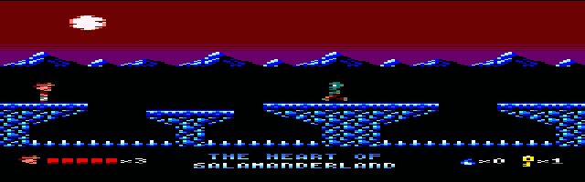
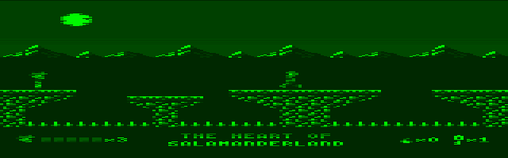
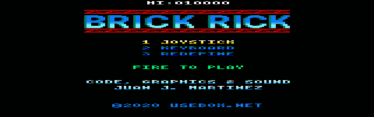
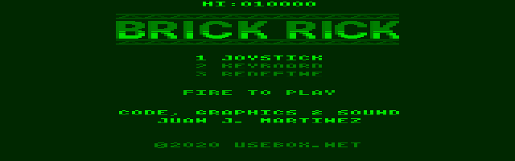
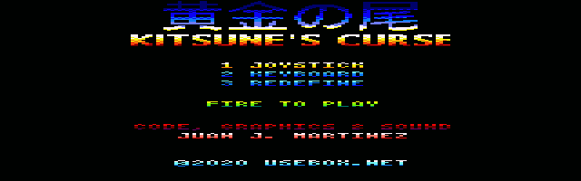
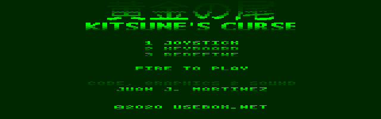
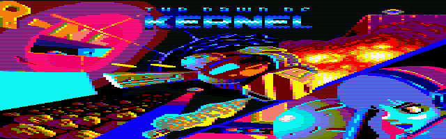
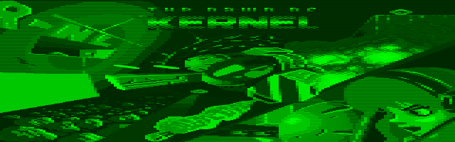
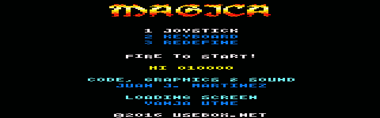
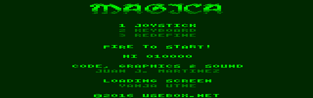

# amstrad-cpc-mcp

A headless, cycle-stepped Amstrad CPC 464, CPC 664 and CPC 6128 emulator,
controlled through the Model Context Protocol over standard input and output.

The Z80, Gate Array, 6845-family CRTC, AY-3-8912, 8255 PPI and optional
uPD765A floppy subsystem run from one 4 MHz master clock. Memory and I/O
requests therefore happen while the other chips advance, and the screen is the
raster produced during those ticks rather than a reconstruction made after a
frame. The MCP surface is intended for developing, loading, running, seeing,
hearing and debugging CPC programs without a graphical front end.

```sh
make roms
make
printf '%s\n' \
  '{"jsonrpc":"2.0","id":1,"method":"initialize","params":{"protocolVersion":"2025-03-26","capabilities":{},"clientInfo":{"name":"probe","version":"1"}}}' \
  '{"jsonrpc":"2.0","method":"notifications/initialized"}' \
  '{"jsonrpc":"2.0","id":2,"method":"tools/call","params":{"name":"status","arguments":{}}}' \
  | bin/bin/amstrad-cpc-mcp --model cpc6128 \
      --os-rom data/roms/cpc6128-os.rom \
      --basic-rom data/roms/cpc6128-basic.rom \
      --amsdos-rom data/roms/amsdos.rom
```

## Five-game MCP showcase

These ten images were produced by booting five standout modern CPC games from
Juan J. Martínez's [free-to-play catalog](https://www.usebox.net/jjm/games/)
through actual MCP sessions. Each pair is the exact same emulated framebuffer:
only the screenshot palette changes between the CTM colour display and the
GT64 green display.

| Game | CTM colour monitor | GT64 green monitor |
|---|---|---|
| The Heart of Salamanderland |  |  |
| Brick Rick |  |  |
| Kitsune's Curse |  |  |
| The Dawn of Kernel |  |  |
| Magica |  |  |

The games are downloaded to ignored build storage rather than redistributed.
[Capture provenance, hashes and exact `RUN` commands](docs/screenshots/README.md)
make the showcase reproducible with `make roms release showcase-captures`.

## Build

The hosted build needs GCC with C++20 support, GNU make, and `curl` only when
fetching ROMs or external test media. Optional live audio uses `aplay` from
`alsa-utils`. Tests expect the project cross compiler at
`../xyz/bin/x/bin/xcc`; override it with `XCC=/path/to/xcc`.

```sh
make                 # static release and Linux-style tree under bin/
make debug           # ASan/UBSan -> bin/bin/amstrad-cpc-mcp-debug
make test            # sanitized unit, MCP, media and xcc tests
make roms            # verified 464/664/6128 firmware download
make references      # verified primary manuals -> build/references
make external-tests  # verified SHAKER test-media download
make firmware-test   # boot/pixel regression for every firmware set
make conformance-smoke # launch SHAKER A through AMSDOS/FDC
make cpm-test         # boot bundled CP/M 2.2 through MCP to A>
make showcase-games  # fetch five verified free-to-play CPC games
make showcase-captures # boot them over MCP and refresh both monitor views
make package         # stage bin/ and share/ under bin/
make help
```

All objects, libraries, test programs and fetched test media live under
`build/`; final output lives under `bin/`. The release server is statically
linked. The final tree mirrors a Linux installation prefix:

```text
bin/
├── bin/amstrad-cpc-mcp
└── share/
    ├── amstrad-cpc-mcp/
    │   ├── disks/
    │   └── roms/
    └── doc/amstrad-cpc-mcp/
```

## Models and firmware

| Model | RAM | Built-in media | Firmware arguments |
|---|---:|---|---|
| CPC 464 | 64 KiB | cassette | OS, BASIC |
| CPC 664 | 64 KiB | 3-inch disk | OS, BASIC, AMSDOS |
| CPC 6128 | 128 KiB | 3-inch disk | OS, BASIC, AMSDOS |

CRTC types 0, 1 and 2 can be selected independently with `--crtc 0`, `1` or
`2`. They map to the conventional HD6845S, UM6845R and MC6845-compatible CPC
families and retain their different register read behavior and sync rules.

Amstrad and Locomotive gave permission for CPC emulator authors to distribute
the system ROMs while retaining copyright. `make roms` downloads unmodified
images, verifies fixed SHA-256 values, and preserves every embedded copyright
notice. Details and sources are in [data/roms/README.md](data/roms/README.md).
The ROM files are ignored by Git so packaging policy remains an explicit choice.

Without external firmware the server uses a deterministic HALT stub, which is
useful for raw machine-code tests but is not CPC BASIC.

## Usage

```text
amstrad-cpc-mcp [--model cpc464|cpc664|cpc6128] [--crtc 0|1|2]
    [--os-rom PATH] [--basic-rom PATH] [--amsdos-rom PATH]
    [--load PATH] [--verbose] [--list-tools] [--version] [--help]
```

`--load` inserts DSK, CDT or TAP media by extension. Other files are loaded as
raw code at `0x8000`. Diagnostics use stderr; stdout is reserved for one
JSON-RPC message per line.

The 23 MCP tools are grouped as follows:

| Purpose | Tools |
|---|---|
| media | `load`, `tape`, `disk`, `cpm` |
| execution | `reset`, `run`, `run_until`, `step`, `status` |
| debugger | `read_memory`, `write_memory`, `registers`, `breakpoint` |
| input and buses | `press_keys`, `read_port`, `write_port`, `ports`, `chips` |
| display | `screen`, `screen_text`, `screenshot` |
| sound | `audio_start`, `audio_stop` |

`read_port` and `write_port` perform the real CPC partial address decoding, so
one access may reach several overlapping devices. `ports` explains every
address-line condition. `screen` returns the 768×272 cycle-rendered overscan or
a 640×200 crop as indexed PNG through either the CTM colour palette or the GT64
green-monitor luminance palette. Audio is mono 16-bit WAV or optional live
ALSA playback at a requested sample rate.

On a CPC6128 with stock firmware, `cpm` resets the machine, inserts the
repository-provided minimal CP/M 2.2 system disk, types `|CPM` through the
emulated
keyboard and runs to the `A>` prompt. The default call has no arguments:

```json
{"name":"cpm","arguments":{}}
```

The disk, its exact provenance and redistribution basis are documented in
[data/disks/README.md](data/disks/README.md). CP/M Plus is not claimed: its
boot still reaches the documented incomplete direct-uPD765A path.

The complete schemas and examples are in the
[user guide](docs/manuals/USER-GUIDE.md), or can be queried with
`make list-tools`.

## Developing with xcc

The integration suite compiles a freestanding C11 program with `xcc`, emits a
raw binary at `0x8000`, loads it into the CPC, disables the firmware overlays,
runs to HALT and checks the computed result in RAM. A typical manual flow is:

```sh
../xyz/bin/x/bin/xcc -Os --oformat=binary -Ttext=0x8000 \
  program.c -o build/program.bin
bin/bin/amstrad-cpc-mcp --model cpc6128 --load build/program.bin
```

Use the MCP debugger tools to set PC/registers, inspect memory, set execute,
memory or I/O breakpoints, step instructions, capture the raster and record AY
output.

## Accuracy and conformance

The automated suite covers all three machine identities, 6128 RAM and ROM
banking, CPC-rounded instruction timing, overlapping I/O decode, Gate Array
mode changes and palette writes, CRTC access, AY register masks, PPI state,
TAP/CDT timing and control flow, DSK validation, PNG round trips, audio/MCP
responses, and the real `xcc` program described above. Stock firmware for all
three models has also been booted to its BASIC prompt, and CP/M 2.2 has been
booted through the public MCP tool to a pinned `A>` screen.

SHAKER 2.7 is available through `make external-tests`. Its DSK has been read by
the emulated FDC and its module-A menu launched. That proves the disk, keyboard,
firmware and loader path; it does not by itself prove every interactive CRTC
test, and this project does not claim the official SHAKER approval seal.
Known conformance boundaries are stated precisely in
[docs/research/CONFORMANCE.md](docs/research/CONFORMANCE.md). In particular,
the implementation is cycle-stepped, but unusual out-of-spec CRTC programming
and protected multi-sector floppy behavior still need real-machine regression
work before an unqualified “cycle perfect for all software” claim would be
honest.

## Layout

```text
include/tools/       MCP tool support headers
src/                 main program and 23 tools
lib/cpc/             complete-machine facade, tape and breakpoints
lib/chips/           pin-level component and CPC-system cores
lib/z80/             vendored tick-stepped Z80 core
lib/mcp/             MCP and JSON-RPC server
lib/json/            JSON parser and writer
lib/png/             indexed PNG encoder
lib/miniz/           vendored DEFLATE implementation
data/roms/           verified firmware fetcher and optional ROMs
data/disks/          included minimal CP/M 2.2 system disk and provenance
tests/               automatic and external conformance tests
docs/notes/          architecture and per-chip engineering notes
docs/research/       sources, verified reference fetcher and conformance
docs/standards/      mandatory project coding standards
```

## Documentation

- [Architecture](docs/notes/ARCHITECTURE.md)
- [Z80](docs/notes/Z80.md)
- [Gate Array](docs/notes/GATE-ARRAY.md)
- [6845 CRTC](docs/notes/CRTC-6845.md)
- [AY-3-8912](docs/notes/AY-3-8912.md)
- [8255 PPI](docs/notes/PPI-8255.md)
- [uPD765A and DSK](docs/notes/UPD765A.md)
- [Memory and ports](docs/notes/MEMORY-AND-PORTS.md)
- [CTM and GT64 monitors](docs/notes/MONITORS.md)
- [Cassette](docs/notes/CASSETTE.md)
- [Research sources](docs/research/SOURCES.md)
- [Reproducible reference bundle](docs/research/REFERENCES.md)

## Licence

Project code is GPL-3.0; see [LICENSE](LICENSE). Vendored `chips`/Z80 code uses
the zlib licence and miniz uses MIT. The included CP/M image remains
copyrighted and is distributed under its separate rights grant described in
[data/disks/README.md](data/disks/README.md). Provenance and local changes are
recorded beside each library.

## Acknowledgements

This project exists because other emulator authors, preservation groups and
hardware researchers published their work. In particular, thank you to:

- André Weissflog for [floooh/chips](https://github.com/floooh/chips), the
  pin-level Z80 and component cores vendored here, and
  [chips-test](https://github.com/floooh/chips-test), which informed component
  validation.
- Rich Geldreich, Tenacious Software, RAD Game Tools, Valve Software and the
  other [miniz contributors](https://github.com/richgel999/miniz) for the
  DEFLATE and CRC implementation used by screenshots and CDT CSW blocks.
- The [Model Context Protocol](https://modelcontextprotocol.io/specification/2025-06-18),
  [JSON-RPC 2.0](https://www.jsonrpc.org/specification),
  [RFC 8259](https://www.rfc-editor.org/rfc/rfc8259) and
  [PNG](https://www.w3.org/TR/png-3/) specification authors for the wire and
  image formats implemented by the server.
- Amstrad and Locomotive Software for the CPC hardware, firmware and published
  firmware interfaces; and Zilog, General Instrument, Motorola, Intel and NEC
  for the Z80, AY-3-8912, 6845, 8255A and uPD765A manuals respectively.
- The [CPCTech archive](https://cpctech.cpcwiki.de/docs.html),
  [CPCWiki contributors](https://www.cpcwiki.eu/),
  [Grimware](https://www.grimware.org/doku.php/documentations/devices/io.devices?do=export_xhtml)
  and [bread80](https://bread80.com/2021/06/03/understanding-the-amstrad-cpc-video-ram-and-gate-array-subsystem/)
  for Gate Array, memory, partial-I/O, video timing, CDT and DSK documentation.
- Siko, Longshot, Shaker and CeD of
  [SHAKERLAND](https://shaker.logonsystem.eu/) for the CRTC Compendium, SHAKER
  suite, real-machine results, portal, automation specifications and graphics.
- Ulrich Doewich and DSkywalk of
  [libretro-cap32](https://github.com/libretro/libretro-cap32/issues/49) for
  preserving and validating the GT64 green-monitor luminance levels.
- The CPC timing-sheet authors and the
  [Octoate archive](https://wiki.octoate.de/lib/exe/fetch.php/amstradcpc%3Az80_cpc_timings_cheat_sheet.20131019.pdf)
  for the CPC-specific Z80 timing reference.
- The [CPCEC](https://github.com/cpcitor/cpcec),
  [CPCEG](https://github.com/AmatCoder/CPCEG) and
  [Arnold](https://github.com/rofl0r/arnold) emulator contributors for source,
  software-compatibility lists and independent implementation comparisons.
- The [Fuse test-suite](https://sourceforge.net/projects/fuse-emulator/files/fuse-test-suite/)
  contributors and Patrik Rak for
  [z80test](https://github.com/raxoft/z80test), whose vectors and exercisers
  informed Z80 validation and the sibling core's regression coverage.
- [CPCEC](https://github.com/cpcitor/cpcec) for the pinned stock ROM images,
  and [WinAPE](https://www.winape.net/help/general.html), the
  [Magnetic Scrolls Memorial](https://msmemorial.if-legends.org/emu/amstradcpc.php)
  and [DeZog](https://github.com/maziac/DeZog/blob/main/documentation/amstrad-rom-permissions.txt)
  for preserving Amstrad's ROM-distribution permission and its provenance.
- Juan J. Martínez for the freely playable showcase games and their manuals;
  Eric Cubizolle (TITAN), Víctor Martínez, Dylan Barry and Vanja Utne for
  credited screen art, story and concept work; Julien Névo (Targhan), Artaburu
  and WYZ for the Arkos 2 Player, cpcrslib and PSG Player foundations; and
  Antxiko, José María Velo, Fran Loscos, Guindako and Juanje for the testing
  credited by those releases.
- Gary Kildall and Digital Research for CP/M; Bryan Sparks and DRDOS, Inc. for
  clarifying its modern redistribution grant; Gaby Chaudry and the Unofficial
  CP/M Web Site for preserving that grant; and CPCWiki and the NVG archive for
  preserving the CPC6128 system disks used to derive the minimal boot image.

The complete source-by-source bibliography and exact pinned revisions are in
[docs/research/SOURCES.md](docs/research/SOURCES.md). Any accidental omission
is an error to correct, not a claim of original authorship.
